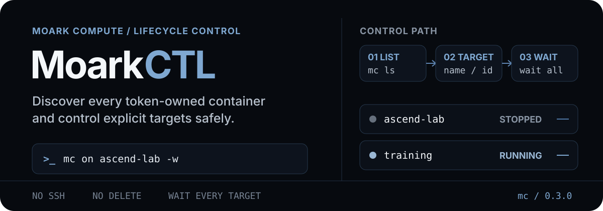

# MoarkCTL

<p align="right"><strong>English</strong> | <a href="./README.md">简体中文</a></p>

<p align="center">
  
</p>

<p align="center">
  <strong>Let agents schedule Moark compute around the work that actually needs a real machine.</strong><br>
  Manage every token-owned container with accelerator or accelerator-free startup, detailed status, and all-target waits.
</p>

<p align="center"><code>Python 3.10+</code> · <code>mc</code> short commands · Multi-instance targeting · Wait for every target</p>

Operator validation, model fine-tuning, and long benchmarks often alternate between local preparation and remote execution. MoarkCTL gives an agent control of that compute window: start before real-machine work, wait for the requested platform state, then shut down after artifacts are safe and confirm the billing boundary.

One access token discovers every container in scope. `mc` adds stable local aliases, accelerator or accelerator-free startup, detailed provider status, and per-target lifecycle receipts. It owns the Moark platform lifecycle; [JupyterCTL](https://github.com/AkkoYK/JupyterCTL) continues with commands, jobs, and files inside the machine.

## Get running in one minute

### 1. Install

`pipx` is recommended. It installs both `moarkctl` and the short alias `mc`:

```bash
cd MoarkCTL
pipx install .
```

Or install into the current Python environment:

```bash
python -m pip install .
```

### 2. Create the private configuration

```bash
mc init
```

This creates `~/.config/moarkctl/config.env` and sets mode `0600` on POSIX systems. Configuration no longer depends on the current directory. Every non-init command prints the exact config path to stderr.

To keep the file elsewhere, use either form:

```bash
mc --env-file /secure/path/moarkctl.env ls
MOARKCTL_CONFIG=/secure/path/moarkctl.env mc ls
```

`mc init --force` replaces an existing file. Use it only when the old configuration is no longer needed.

### 3. Create and enter the access token

1. Sign in to Moark and switch to the workspace that owns the intended compute containers.
2. Open [Settings → Access Tokens](https://moark.com/kdakztwn/dashboard/settings/tokens).
3. Create a token and copy it immediately. If scopes are available, grant compute-container read, start, stop, and reboot permissions without unrelated privileges.
4. Edit `~/.config/moarkctl/config.env` and put the raw value in `MOARK_TOKEN`. Do not add `Bearer` or place the token in a command, README, or chat message.

```bash
MOARK_TOKEN=
MOARK_DEFAULT_INSTANCE=
MOARK_BASE_URL=https://api.moark.com/v1
```

| Variable | What to enter | Required? |
| --- | --- | --- |
| `MOARK_TOKEN` | Raw value from the access-token page, without `Bearer` | Required |
| `MOARK_DEFAULT_INSTANCE` | After `mc ls`, a local alias, exact name, full ID, or unique ID prefix | Optional |
| `MOARK_INSTANCE_<LOCAL_NAME>` | Replace `-` with `_` in the local name; set the value to the full ID from `mc ls` | Optional; recommended when the platform name is empty |
| `MOARK_BASE_URL` | Keep `https://api.moark.com/v1` | Optional; normally unchanged |
| `MOARK_HTTP_TIMEOUT` | Timeout for one API request, in seconds | Optional; defaults to `60` |
| `MOARK_POLL_INTERVAL` | Poll interval used by `-w`, in seconds | Optional; defaults to `8` |
| `MOARK_POLL_TIMEOUT` | Total lifecycle wait timeout, in seconds | Optional; defaults to `600` |

Initial discovery requires no instance ID: `mc ls` lists every compute container the token may manage. If the platform `name` is empty or unstable, add a local mapping after discovery:

```bash
MOARK_INSTANCE_NPU_910B=NHRNUEKVXXGAEI1U
MOARK_DEFAULT_INSTANCE=npu-910b
```

The environment suffix is lowercased and `_` becomes `-`, so the example is selected as `npu-910b`. `mc ls` reports resolved mappings under `local_aliases`; an alias that is missing or ambiguous is reported and cannot drive a lifecycle action. Placeholder values such as `replace-me` and `your-token` are rejected before any API request.

### 4. Run the read-only acceptance check

```bash
mc self-test
mc ls
```

`self-test` checks configuration, token authentication, and Moark API discovery. It never starts, stops, or reboots a container. Its output includes `config_file`, instance count, and sanitized instance summaries. `platform_status` is the provider lifecycle state, while `status_detail` classifies it as active, transitioning, inactive, or failed. `accelerator_health` is populated only when the API exposes a device-health field; otherwise it is explicitly `unknown`, never inferred from `running`.

### 5. Start and stop compute

```bash
# Start by local alias and wait for running.
mc on npu-910b -w

# Start without accelerator resources for CPU, disk, or network work.
mc on npu-910b -c -w
# -c means --no-accelerator; --no-gpu and --cpu-only are also accepted.

# Stop after results are persisted and wait for stopped.
mc off npu-910b -w
```

Plain `mc on` preserves the existing behavior and sends `with_gpu=true`. Only explicit `-c` sends `with_gpu=false`, matching the [official Moark OpenAPI](https://moark.com/docs/openapi/v1). If the instance is already `running`, MoarkCTL does not reboot it merely to change modes; the receipt reports `request_sent=false` and `start_mode=not_requested_already_running`. To switch between accelerator and accelerator-free modes, first persist the active work, then stop and restart in the intended mode.

## Explicit multi-instance operations

| Guardrail | Behavior |
| --- | --- |
| Discover first | `mc ls` builds the current inventory of every token-owned container |
| Select explicitly | Local aliases, full IDs, unique ID prefixes, and exact platform names identify targets |
| Reject ambiguity | Duplicate names, non-unique prefixes, and missing targets with multiple containers fail closed |
| Require explicit all | An operation covering every container must include `--all` |
| Wait for every target | `-w` follows each selected container until all settle or time out explicitly |
| Focus on lifecycle | Instance creation, deletion, and volume deletion remain in the provider console |

When the token owns one container, omitting the target selects it automatically. With several containers, set `MOARK_DEFAULT_INSTANCE` only after discovery; it may contain a local alias, exact name, full ID, or unique ID prefix.

## Short command reference

| Short command | Full command | Purpose |
| --- | --- | --- |
| `check` | `self-test` | Read-only configuration and discovery test |
| `ls` / `st` | `list` / `status` | List all or selected containers |
| `on` | `start` | Start with an accelerator by default; add `-c` for accelerator-free startup |
| `off` | `shutdown` | Stop a compute container |
| `re` | `reboot` | Reboot a compute container |

Manage a bounded set of explicit targets:

```bash
mc on ascend-lab nvidia-987 -w
mc off ascend-lab nvidia-987 -w
```

An operation covering every token-owned container must include `--all`:

```bash
mc off --all -w
```

`-w` is short for `--wait`. Use `-t SECONDS` to override one wait timeout. Use `mc ls --json` for a structured list.

## What instance status includes

Human output from `mc ls` / `mc st` includes the provider status and Chinese label, state category, zone, accelerator specification, device health, system/data disk rates, last update time, and billing type. JSON additionally retains:

- `status_detail`, classifying `pending`, `running`, `restarting`, `stopped`, and `failed`, including transition, terminal, and failure flags;
- `zone`, `disk_usage.system_disk_rate`, and `disk_usage.data_disk_rate`;
- `lifecycle_timestamps` for creation, update, expiration, start, and stop, with both provider values and UTC ISO timestamps;
- `health_fields` for additional maintenance, alert, and health data returned by the provider.

The official instance-list response exposes accelerator specifications. The current API does not include attachment telemetry for the active boot, so `accelerator_attachment` remains `unknown`. An accelerator-free receipt records that the request sent `with_gpu=false`; actual attachment can be added when the platform exposes that telemetry.

Lifecycle commands also accept `--json`:

```bash
mc on npu-910b -w --json
mc off npu-910b -w --json
```

Output always contains a `receipts` array. Every target has `selector`, `resolved_instance_id`, `local_alias`, `before`, `after`, `desired`, `request_sent`, `request_accepted`, `request_error`, `waited`, `wait_completed`, and `settled`. Start receipts also include `start_mode` and `with_accelerator_requested`. Without `-w`, `after` is one post-request observation. Even with `-w`, an explicit per-target rejection exits immediately as `lifecycle_request_rejected` instead of misreporting the target as settled. When shutdown completion is the billing boundary, require every receipt to satisfy `request_accepted!=false`, `wait_completed=true`, `after=stopped`, and `settled=true`. When a local alias is used, start and reboot receipts provide an exact `next_step`, such as `jc -i npu-910b doctor --json`, because instance reconstruction may rotate the Jupyter token.

Every machine-readable response uses the same top-level protocol: `schema_version`, `command`, `target`, `started_at`, `elapsed_seconds`, `success`, `error`, and `data`. Common result fields remain mirrored at the top level so existing scripts can migrate to `data` gradually.

## Actionable network error categories

MoarkCTL classifies failures as `dns_error`, `connect_timeout`, `tls_error`, `auth_error`, `api_error`, or the general `network_error`. Errors include only the sanitized API hostname and a suggested action, never the token. When a command uses `--json`, failure output retains stable `error.code`, `error.phase`, `error.retryable`, `error.api_host`, and `error.suggested_action` fields so a harness can choose between refreshing credentials, checking connectivity, or retrying later.

## Responsibility split with JupyterCTL

| Tool | Responsibility | Common short commands |
| --- | --- | --- |
| [MoarkCTL](https://github.com/AkkoYK/MoarkCTL) | Platform lifecycle and the billing boundary | `mc on`, `mc off`, `mc re` |
| [JupyterCTL](https://github.com/AkkoYK/JupyterCTL) | Commands, terminals, and files inside the machine | `jc x`, `jc u`, `jc d` |

`platform_status=running` marks the provider's running state. `mc ls --json` preserves maintenance, alert, and health data under `health_fields`; when the current API has no device-health value, `accelerator_health` remains `unknown`. Continue with JupyterCTL to inspect drivers, accelerators, storage, caches, and the research environment. Before shutdown, confirm that background jobs have ended and that logs, checkpoints, and results are persisted.

See [SKILL.md](SKILL.md) for the compact agent workflow.

## Development and license

```bash
python -m pip install -e '.[dev]'
pytest
```

MoarkCTL is licensed under the [Apache License 2.0](LICENSE). Copyright 2026 AkkoYK. See [NOTICE](NOTICE).
