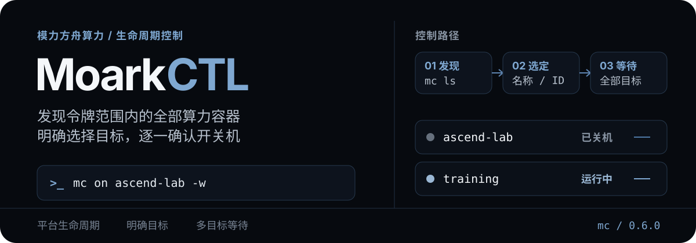

# MoarkCTL

<p align="center">
  
</p>

<p align="center">
  <strong>让 Agent 在需要真机时开机，保存好结果后关机。</strong><br>
  查询、启动、停止与重启模力方舟算力容器；不再把 SSH 和文件传输塞进同一个工具。
</p>

<p align="center"><code>Python 3.10+</code> · <code>mc</code> 短命令 · 多实例选择 · 全目标状态等待</p>

夜间训练、长时间 benchmark 和多台异构机器叠在一起时，最容易漏掉的是实验结束后的那次关机。网页控制台还开着，Agent 已经没有任务，费用却继续走。

MoarkCTL 把模力方舟算力容器的查询和生命周期操作收进一组短命令。它只负责平台控制；远端 Shell、终端保留和文件传输交给 JupyterCTL。

## 一分钟跑通

### 1. 安装短命令

推荐用 `pipx`，安装后同时得到 `moarkctl` 和 `mc`：

```bash
cd MoarkCTL
pipx install .
```

也可以装进当前 Python 环境：

```bash
python -m pip install .
```

### 2. 获取并填写访问令牌

1. 登录 [模力方舟](https://moark.com)，切换到持有目标算力容器的工作空间。
2. 进入“设置 → 访问令牌”。页面地址形如 `https://moark.com/<工作空间>/dashboard/settings/tokens`；其中 `<工作空间>` 会随账户或组织变化，不要照抄别人的地址。
3. 创建一个新的访问令牌并立即复制。如果页面提供权限范围，令牌至少需要读取算力容器，以及启动、停止和重启容器的权限；不要额外开放 MoarkCTL 用不到的权限。
4. 把令牌原文填入 `MOARK_TOKEN`。不要添加 `Bearer` 前缀，也不要把令牌放进命令行、README 或聊天记录。

```bash
cp moarkctl.env.example .moarkctl.env
chmod 600 .moarkctl.env
```

最小配置只有一项：

```bash
MOARK_TOKEN=replace-me
```

> 不需要预先填写实例 ID。`mc ls` 会查询该令牌有权管理的全部算力容器。

| 环境变量 | 如何填写 | 是否必填 |
| --- | --- | --- |
| `MOARK_TOKEN` | 当前工作空间“设置 → 访问令牌”页面生成的原始令牌，不含 `Bearer` | 必填 |
| `MOARK_DEFAULT_INSTANCE` | 先运行 `mc ls`，再填写常用容器的精确名称、完整 ID 或唯一 ID 前缀 | 可选 |
| `MOARK_BASE_URL` | 保持官方默认值 `https://api.moark.com/v1` | 可选，通常不要修改 |
| `MOARK_HTTP_TIMEOUT` | 单次 API 请求超时秒数 | 可选，默认 `60` |
| `MOARK_POLL_INTERVAL` | `-w` 等待状态时的轮询间隔秒数 | 可选，默认 `8` |
| `MOARK_POLL_TIMEOUT` | `-w` 等待状态的总超时秒数 | 可选，默认 `600` |

填写后先运行 `mc ls` 验证。它只读取并列出容器，不会开关机；若返回 `401` 或 `403`，检查令牌是否来自正确工作空间、是否仍然有效，以及是否具备算力容器管理权限。

### 3. 查询、开机、关机

```bash
# 发现全部实例
mc ls

# 按平台名称开机，并等待进入 running
mc on ascend-lab -w

# 实验结果落盘后关机，并等待进入 stopped
mc off ascend-lab -w
```

## 为什么多实例操作不容易点错

| 保护点 | 行为 |
| --- | --- |
| 先发现 | `mc ls` 从令牌范围内读取全部容器，不依赖写死的实例 ID |
| 明确选择 | 完整 ID、唯一 ID 前缀和平台名称都可以作为目标 |
| 拒绝歧义 | 名称重复、前缀不唯一或多实例未指定目标时直接报错 |
| 显式全选 | 操作全部容器必须传 `--all` |
| 全量等待 | `-w` 会检查每个目标，不会只看列表中的第一台机器 |
| 避免破坏 | 没有创建、销毁实例或删除数据盘的命令 |

只有一个容器时，不传目标会自动选择它。账户里有多台机器时，可以设置可选的 `MOARK_DEFAULT_INSTANCE`；它接受名称、完整 ID 或唯一前缀，并不要求把实例 ID 写死在配置中。

## 常用短命令

| 短命令 | 完整命令 | 用途 |
| --- | --- | --- |
| `ls` / `st` | `list` / `status` | 查看全部或指定容器 |
| `on` | `start` | 带加速卡开机 |
| `off` | `shutdown` | 关停算力容器 |
| `re` | `reboot` | 重启算力容器 |

同时管理一组明确目标：

```bash
mc on ascend-lab nvidia-987 -w
mc off ascend-lab nvidia-987 -w
```

对令牌下的全部容器执行操作必须显式传 `--all`：

```bash
mc off --all -w
```

`-w` 是 `--wait`，`-t SECONDS` 可以覆盖本次等待时间。需要结构化输出时使用：

```bash
mc ls --json
```

## 和 JupyterCTL 怎么分工

| 工具 | 负责什么 | 常用短命令 |
| --- | --- | --- |
| [MoarkCTL](https://github.com/AkkoYK/MoarkCTL) | 平台生命周期与计费边界 | `mc on`、`mc off`、`mc re` |
| [JupyterCTL](https://github.com/AkkoYK/JupyterCTL) | 远端命令、保留终端与文件传输 | `jc x`、`jc u`、`jc d` |

这个独立版本没有沿用早期原型里的 SSH、远端命令、项目同步和文件传输。职责拆开后，Moark 访问令牌只用于平台控制，远端实验操作也不依赖平台 SSH 网关。

## Agent 使用边界

- `running` 只是平台状态，不代表驱动、加速卡、磁盘、模型缓存和实验环境已经就绪。开机后用 JupyterCTL 重新检查。
- 交互终端消失不等于任务结束。关机前确认后台进程、日志、checkpoint 和结果文件已经处理完。
- `mc off` 只证明平台进入 `stopped`，不证明实验完成或通过验收。
- 不读取或打印 `.moarkctl.env`，不把 `MOARK_TOKEN` 放进命令、日志或对话。

给 Agent 的精简开关机流程见 [SKILL.md](SKILL.md)。

## 许可证

本项目采用 [Apache License 2.0](LICENSE) 许可，版权归 AkkoYK 所有，详见 [NOTICE](NOTICE)。

## 开发

```bash
python -m pip install -e '.[dev]'
pytest
```

测试覆盖多实例发现与选择、歧义拒绝、全目标轮询、短命令解析和凭据脱敏。
